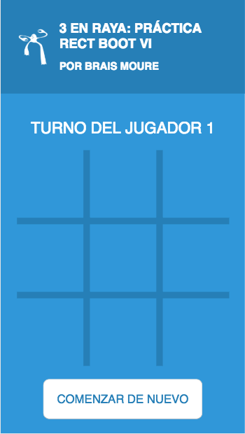
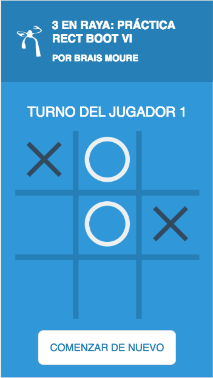
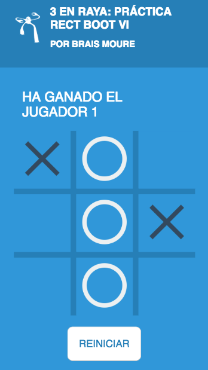
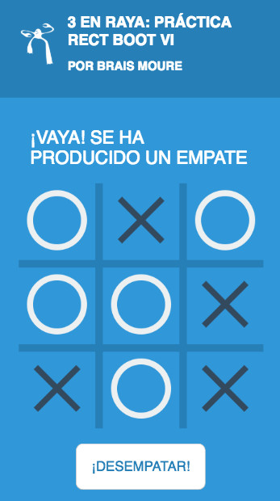

# Práctica de programación React Boot VI (2018)
## Por Brais Moure Morais

Juego 3 en raya creadao con React y persistencia local.

## Primeros pasos
* Tener instalado yarn: [https://yarnpkg.com/en/docs/install#mac-stable](https://yarnpkg.com/en/docs/install#mac-stable)
* Instalar dependencias: `yarn install`
* Iniciar aplicación: `yarn start`
* Acceder al juego: [http://localhost:3000/](http://localhost:3000/)
* Ejecutar test: `yarn test`

## Preview

### Autor
*Brais Moure Morais. © 2017-2018*